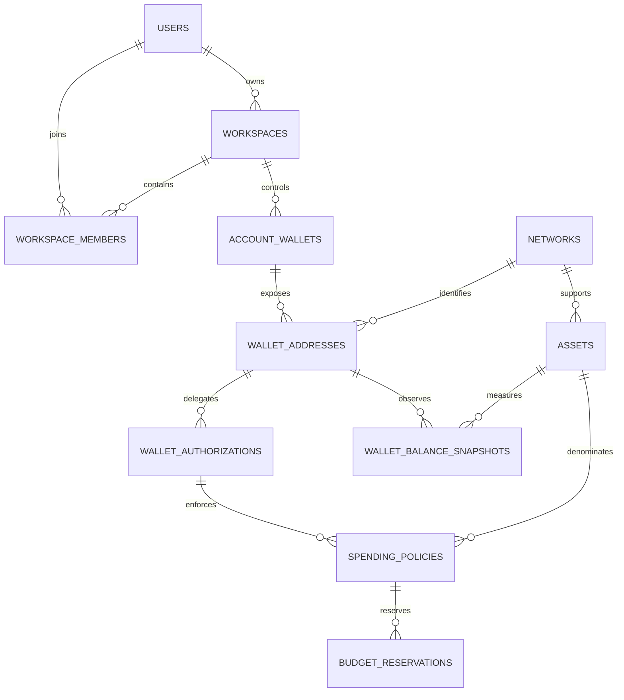
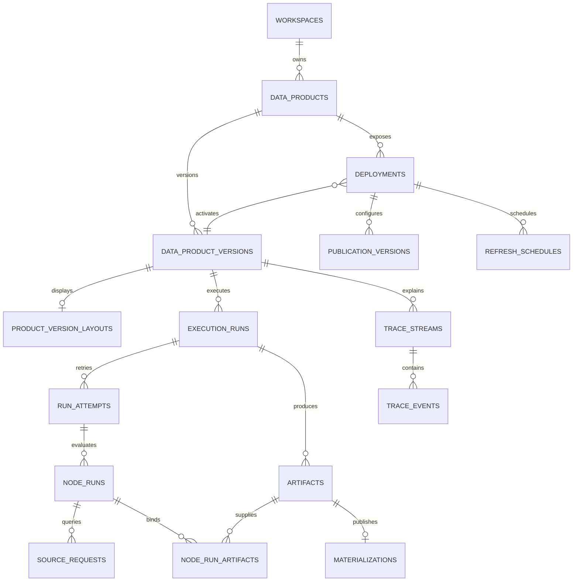
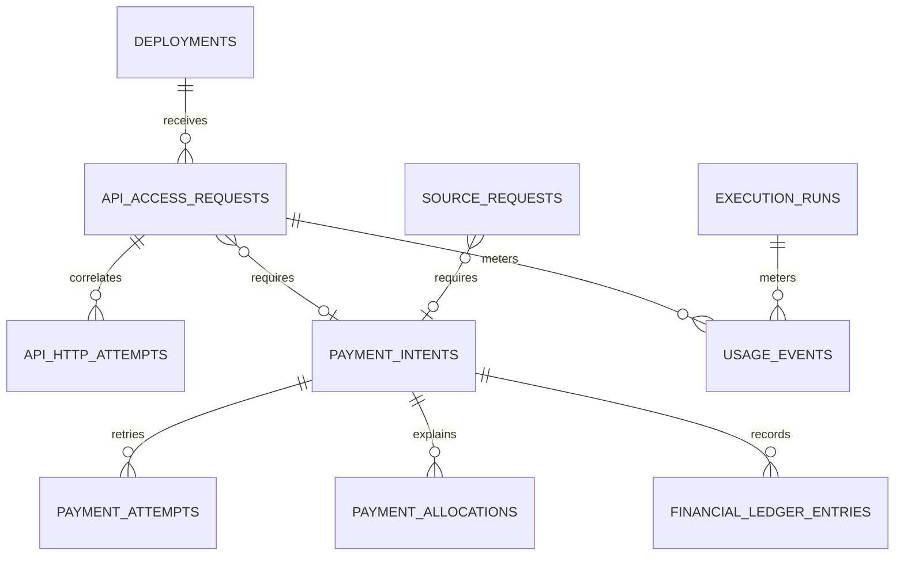

# Sprue Data Model

## Status

Version: 1.0

Date: 2026-09-05

Stage: Approved as the MVP implementation baseline. External integration and implementation validation remain open.

This document is the source of truth for Sprue's MVP domain model, PostgreSQL persistence model, lifecycle rules, financial separation, and runtime records. It translates the product and architecture decisions in [agents.md](agents.md), [plan.md](plan.md), and [project-structure.md](project-structure.md) into an implementation-ready model.

The model describes intended behavior. It is not evidence that an external wallet, payment, Graph, Hedera, or Blocky402 integration works.

## Confirmed Inputs

- A creator uses natural language to define a persistent Graph-backed data product.
- The Agent dynamically composes predefined, developer-implemented DAG operators. It does not generate arbitrary executable JavaScript or Python for the MVP.
- Product definitions and execution layouts are separate.
- Product edits create auditable versions; an unsuccessful edit must not replace the last working version.
- The creator has an account-level Privy-backed wallet and can authorize bounded Graph spending.
- Graph purchases use a Base or Base Sepolia payment path and remain separate from Hedera API-sale proceeds.
- A product can remain private or be published behind Sprue's x402 gate, with Hedera settlement through Blocky402.
- The creator controls the intended sales recipient. Privy-to-Hedera compatibility remains unverified and must be represented as a verification state.
- A Sprue service fee is disabled unless explicit terms and a working settlement mechanism are approved.
- The evaluator deployment uses Vercel plus Railway; the same application must run through Docker Compose without source changes.
- PostgreSQL is the source of truth. Service and container filesystems are ephemeral.

## Confirmed MVP Defaults

The human team confirmed these defaults on 2026-09-05.

1. **MVP serving mode:** return the latest successful materialization. An API request does not run a fresh paid Graph query. A future `live` mode is modeled but disabled.
2. **Workspace scope:** model workspace membership and roles now, but implement only a single-owner flow in the MVP. Invitations, role-management UI, and non-owner authorization flows are deferred.
3. **Artifact storage:** store bounded JSON artifacts in PostgreSQL up to 5 MiB per artifact. Keep an object-storage adapter in the schema for later use.
4. **Conversation retention:** retain user-visible Agent messages and build traces for the product's lifetime. Never persist hidden chain-of-thought. Support content redaction while preserving hashes and audit metadata when deletion is required.

The existing fee decision is not reopened here: the default fee remains zero/disabled.

## Modeling Conventions

### Names and Identifiers

- PostgreSQL tables and columns use `snake_case`; application types use `PascalCase`.
- Primary keys use PostgreSQL `uuid` values generated by the application or database.
- User-facing product URLs use stable slugs; slugs are not primary keys.
- External provider identifiers use `text`. Never force chain IDs, Hedera account IDs, transaction hashes, or provider request IDs into UUID or integer types.
- All workspace-owned records include `workspace_id`, directly or through an unambiguous parent.

### Time

- Timestamps use `timestamptz` and are interpreted as UTC.
- Business periods include explicit start and end timestamps.
- `created_at` is immutable. Mutable configuration records also have `updated_at` and `lock_version` for optimistic concurrency.

### Money and Assets

- Monetary quantities use `numeric(78, 0)` atomic units and are non-negative unless a field explicitly represents a signed delta.
- TypeScript reads monetary values as decimal strings or `bigint`; it must not use JavaScript `number` for persisted amounts.
- Every monetary record references one `network` and one `asset`.
- Human-readable amounts are derived from `amount_atomic` and the asset's pinned `decimals` value.
- Balances on different networks or in different assets are never summed into one spendable balance.

### JSONB Boundaries

Use `jsonb` only for validated, versioned documents whose shape is controlled by application schemas:

- DAG specifications and visual layouts;
- output schemas and bounded dynamic data artifacts;
- provider-specific metadata with no secrets;
- authorization scopes and resource policies;
- sanitized request/response metadata.

Each JSON document has a schema version where evolution is expected. Unknown unvalidated JSON must not be written to source-of-truth fields.

### Secrets and Sensitive Values

- Store provider wallet IDs, policy IDs, and credential references, never private keys, seed phrases, raw API keys, or wallet signing material.
- Store API credentials as a prefix plus a one-way hash.
- Store hashes of x402 authorization payloads when correlation is required; do not persist reusable raw authorization headers.
- Remove credentials from Graph endpoint URLs before persistence.
- Agent messages and trace metadata pass through secret redaction before persistence.

### Deletion and Auditability

- Core products, versions, payment records, ledger entries, and execution evidence are archived or reversed, not hard-deleted during normal operation.
- Confirmed financial records are append-only. Corrections create explicit reversal records.
- Foreign keys default to `RESTRICT`. Cascading deletion is allowed only for disposable, unconfirmed child records and must be reviewed in the migration.

## High-Level Relationships

### Identity, Wallet, and Policy



### Product, Deployment, and Execution



### API Access and Finance



## Canonical Data Product Specification

`data_product_versions.specification_json` is the canonical execution definition. It is validated against an application schema and hashed after canonical JSON serialization.

```json
{
  "schemaVersion": 1,
  "runtimeVersion": "1",
  "intent": {
    "summary": "Measure DEX stickiness on Base over the last 30 days"
  },
  "sources": [
    {
      "id": "source_dex_activity",
      "provider": "the_graph",
      "kind": "subgraph",
      "adapterVersion": "1",
      "dataNetwork": "eip155:8453",
      "providerSourceId": "deployment-or-subgraph-id",
      "schemaHash": "sha256:...",
      "credentialRef": "graph/default"
    }
  ],
  "dag": {
    "nodes": [
      {
        "id": "source1",
        "type": "source",
        "operatorVersion": "1",
        "config": {
          "sourceId": "source_dex_activity",
          "queryDocument": "query Activity($start: Int!, $end: Int!, $first: Int!, $skip: Int!) { ... }",
          "variableBindings": {"start": "run.window.start", "end": "run.window.end"},
          "pagination": {"strategy": "offset", "pageSize": 1000}
        }
      },
      {"id": "filter1", "type": "filter", "operatorVersion": "1", "config": {"minimumActiveDays": 2}},
      {"id": "aggregate1", "type": "aggregate", "operatorVersion": "1", "config": {"groupBy": ["protocol"]}},
      {"id": "output1", "type": "output", "operatorVersion": "1", "config": {}}
    ],
    "edges": [
      {"fromNode": "source1", "fromPort": "rows", "toNode": "filter1", "toPort": "rows"},
      {"fromNode": "filter1", "fromPort": "rows", "toNode": "aggregate1", "toPort": "rows"},
      {"fromNode": "aggregate1", "fromPort": "rows", "toNode": "output1", "toPort": "rows"}
    ]
  },
  "outputSchema": {
    "type": "array",
    "items": {
      "type": "object",
      "properties": {
        "protocol": {"type": "string"},
        "stickiness": {"type": "number"}
      }
    }
  },
  "refreshPolicy": {
    "mode": "scheduled",
    "cronExpression": "0 0 * * *",
    "timezone": "UTC"
  },
  "resourcePolicy": {
    "maxNodes": 12,
    "maxSourceRows": 50000,
    "maxSourceRequests": 100,
    "maxOutputRows": 5000,
    "maxOutputBytes": 5242880,
    "maxStoredBytes": 20971520,
    "maxRuntimeMs": 120000
  }
}
```

Rules:

- Node IDs are unique within a version and remain stable in run records.
- Node types and versions come from the registered operator allowlist.
- Source entries pin provider identity, data network, and schema hash.
- Source nodes pin a bounded query document/template, runtime variable bindings, and pagination strategy. The adapter must not silently broaden the query.
- The credential reference names server-side configuration but contains no credential.
- The execution definition has no viewport coordinates or UI-only styling.
- The validator rejects cycles, incompatible ports, unsupported configuration, missing sources, and policies outside platform limits.
- A version pins the meaning of time windows, inclusion/exclusion rules, missing-data behavior, and output schema.

## Table Catalog

### 1. Identity and Workspace

#### `users`

| Column | Type | Null | Rules and purpose |
|---|---|---:|---|
| `id` | `uuid` | no | Primary key |
| `auth_provider` | `text` | no | Initially `privy`; check-constrained |
| `auth_subject` | `text` | no | Stable provider user ID; never an access token |
| `display_name` | `text` | yes | Optional user-facing name |
| `status` | `text` | no | `active`, `suspended`, `closed` |
| `created_at` | `timestamptz` | no | Immutable creation time |
| `last_seen_at` | `timestamptz` | yes | Operational metadata |

Constraints and indexes:

- Unique `(auth_provider, auth_subject)`.
- Index `(status, created_at)`.

#### `workspaces`

| Column | Type | Null | Rules and purpose |
|---|---|---:|---|
| `id` | `uuid` | no | Primary key |
| `owner_user_id` | `uuid` | no | FK to `users` |
| `slug` | `text` | no | Stable URL-safe workspace slug |
| `name` | `text` | no | Display name |
| `status` | `text` | no | `active`, `suspended`, `archived` |
| `created_at` | `timestamptz` | no | Creation time |
| `updated_at` | `timestamptz` | no | Last mutable metadata update |
| `lock_version` | `integer` | no | Default `0`; optimistic concurrency |

Constraints and indexes:

- Globally unique `slug` for the MVP.
- The owner must also have an active `owner` membership.

#### `workspace_members`

| Column | Type | Null | Rules and purpose |
|---|---|---:|---|
| `id` | `uuid` | no | Primary key |
| `workspace_id` | `uuid` | no | FK to `workspaces` |
| `user_id` | `uuid` | no | FK to `users` |
| `role` | `text` | no | `owner`, `builder`, `viewer` |
| `status` | `text` | no | `active`, `invited`, `revoked` |
| `created_at` | `timestamptz` | no | Membership creation time |
| `revoked_at` | `timestamptz` | yes | Required when revoked |

Constraints and indexes:

- Unique `(workspace_id, user_id)`.
- At least one active owner is an application invariant.
- MVP authorization exposes only the owner path unless collaboration is confirmed.

### 2. Networks and Assets

#### `networks`

| Column | Type | Null | Rules and purpose |
|---|---|---:|---|
| `id` | `uuid` | no | Primary key |
| `namespace` | `text` | no | For example `eip155` or `hedera` |
| `reference` | `text` | no | Chain/network reference as text |
| `environment` | `text` | no | `testnet` or `mainnet` |
| `name` | `text` | no | Display name |
| `explorer_base_url` | `text` | yes | Non-secret explorer URL |
| `status` | `text` | no | `enabled`, `disabled` |

Constraints and indexes:

- Unique `(namespace, reference)`.
- Seed only explicitly supported payment and source networks.

#### `assets`

| Column | Type | Null | Rules and purpose |
|---|---|---:|---|
| `id` | `uuid` | no | Primary key |
| `network_id` | `uuid` | no | FK to `networks` |
| `standard` | `text` | no | `native`, `erc20`, `hts`, or verified equivalent |
| `asset_identifier` | `text` | no | Contract, token, or canonical native identifier |
| `symbol` | `text` | no | Display symbol; not an identity |
| `decimals` | `smallint` | no | Check `0 <= decimals <= 255` |
| `status` | `text` | no | `enabled`, `disabled`, `unverified` |

Constraints and indexes:

- Unique `(network_id, standard, asset_identifier)`.
- Asset metadata is pinned for financial records and changed only through an audited migration or administration action.

### 3. Wallets, Delegation, and Budget

#### `account_wallets`

Logical creator wallet identity. It can have multiple network-specific addresses without implying transferable balances or signer compatibility.

| Column | Type | Null | Rules and purpose |
|---|---|---:|---|
| `id` | `uuid` | no | Primary key |
| `workspace_id` | `uuid` | no | FK to `workspaces` |
| `owner_user_id` | `uuid` | no | FK to `users` |
| `provider` | `text` | no | Initially `privy`; external accounts remain explicit |
| `provider_wallet_id` | `text` | no | Provider reference, never key material |
| `label` | `text` | yes | User-facing label |
| `control_model` | `text` | no | `user_owned`, `user_owned_delegated`, `external`, `unverified` |
| `status` | `text` | no | `provisioning`, `active`, `restricted`, `revoked`, `failed` |
| `created_at` | `timestamptz` | no | Creation time |
| `updated_at` | `timestamptz` | no | Status/metadata update |

Constraints and indexes:

- Unique `(provider, provider_wallet_id)`.
- Index `(workspace_id, status)`.
- No private key, seed, recovery material, or reusable signing token column is allowed.

#### `wallet_addresses`

| Column | Type | Null | Rules and purpose |
|---|---|---:|---|
| `id` | `uuid` | no | Primary key |
| `account_wallet_id` | `uuid` | no | FK to `account_wallets` |
| `network_id` | `uuid` | no | FK to `networks` |
| `address_kind` | `text` | no | `evm`, `hedera_account`, `hedera_alias`, or supported equivalent |
| `address` | `text` | no | Original display form |
| `normalized_address` | `text` | no | Network-aware comparison form |
| `can_spend` | `boolean` | no | Default `false`; proven capability only |
| `can_receive` | `boolean` | no | Default `false`; proven capability only |
| `control_status` | `text` | no | `unverified`, `pending`, `verified`, `rejected` |
| `control_evidence_ref` | `text` | yes | Sanitized repository evidence path or provider reference |
| `verified_at` | `timestamptz` | yes | Set only after the demonstrated control check |
| `status` | `text` | no | `active`, `disabled` |
| `created_at` | `timestamptz` | no | Creation time |

Constraints and indexes:

- Unique `(network_id, address_kind, normalized_address)`.
- A publication cannot activate unless its recipient address has `can_receive = true` and `control_status = 'verified'`.
- `can_spend` and `can_receive` are independent.

#### `wallet_authorizations`

| Column | Type | Null | Rules and purpose |
|---|---|---:|---|
| `id` | `uuid` | no | Primary key |
| `workspace_id` | `uuid` | no | FK to `workspaces` |
| `wallet_address_id` | `uuid` | no | FK to `wallet_addresses` |
| `provider` | `text` | no | Initially `privy` |
| `provider_authorization_id` | `text` | no | Policy/signer/intent reference |
| `authorization_type` | `text` | no | `policy`, `signer`, `quorum`, `intent` |
| `scope_schema_version` | `integer` | no | Scope document version |
| `scope_json` | `jsonb` | no | Validated network, method, asset, recipient, and amount scope |
| `status` | `text` | no | `pending`, `active`, `revoked`, `expired`, `failed` |
| `valid_from` | `timestamptz` | yes | Optional provider validity start |
| `valid_until` | `timestamptz` | yes | Optional expiry |
| `revoked_at` | `timestamptz` | yes | Required when revoked |
| `created_at` | `timestamptz` | no | Creation time |

Constraints and indexes:

- Unique `(provider, provider_authorization_id)`.
- Index `(wallet_address_id, status, valid_until)`.
- Application spending checks do not replace provider-enforced wallet controls.

#### `spending_policies`

Sprue's application-level budget policy for bounded Graph purchases.

| Column | Type | Null | Rules and purpose |
|---|---|---:|---|
| `id` | `uuid` | no | Primary key |
| `workspace_id` | `uuid` | no | FK to `workspaces` |
| `wallet_authorization_id` | `uuid` | no | FK to `wallet_authorizations` |
| `network_id` | `uuid` | no | Payment network |
| `asset_id` | `uuid` | no | Payment asset on the same network |
| `purpose` | `text` | no | MVP value `graph_purchase` |
| `allowed_destinations_json` | `jsonb` | no | Validated Graph gateway/facilitator/payee references |
| `max_per_request_atomic` | `numeric(78,0)` | no | Positive upper bound |
| `max_per_period_atomic` | `numeric(78,0)` | no | Positive period budget |
| `period_kind` | `text` | no | `day`, `week`, `month`, `fixed_window` |
| `period_starts_at` | `timestamptz` | no | Current fixed boundary |
| `period_ends_at` | `timestamptz` | no | Must be later than start |
| `max_total_atomic` | `numeric(78,0)` | yes | Optional lifetime cap |
| `status` | `text` | no | `draft`, `active`, `paused`, `exhausted`, `revoked`, `expired` |
| `created_by_user_id` | `uuid` | no | Human approver |
| `created_at` | `timestamptz` | no | Creation time |
| `updated_at` | `timestamptz` | no | Status/window update |
| `lock_version` | `integer` | no | Optimistic concurrency |

Constraints and indexes:

- Asset must belong to `network_id`.
- Amount limits are non-negative and `max_per_request_atomic <= max_per_period_atomic`.
- Index `(workspace_id, status, period_ends_at)`.
- Depositing more funds does not update policy limits automatically.

#### `budget_reservations`

| Column | Type | Null | Rules and purpose |
|---|---|---:|---|
| `id` | `uuid` | no | Primary key |
| `spending_policy_id` | `uuid` | no | FK to `spending_policies` |
| `execution_run_id` | `uuid` | no | FK to `execution_runs` |
| `node_id` | `text` | yes | Source node expected to spend the reservation |
| `idempotency_key` | `text` | no | Stable per intended paid operation |
| `amount_atomic` | `numeric(78,0)` | no | Reserved maximum, positive |
| `status` | `text` | no | `reserved`, `consumed`, `released`, `expired` |
| `expires_at` | `timestamptz` | no | Lease-like reservation expiry |
| `consumed_payment_intent_id` | `uuid` | yes | FK to `payment_intents` when consumed |
| `created_at` | `timestamptz` | no | Reservation time |
| `updated_at` | `timestamptz` | no | State transition time |

Constraints and indexes:

- Unique `(spending_policy_id, idempotency_key)`.
- Index `(spending_policy_id, status, expires_at)` for atomic available-budget checks.
- A reservation is consumed at most once and only by a payment in the same network/asset.

#### `wallet_balance_snapshots`

| Column | Type | Null | Rules and purpose |
|---|---|---:|---|
| `id` | `uuid` | no | Primary key |
| `wallet_address_id` | `uuid` | no | FK to `wallet_addresses` |
| `asset_id` | `uuid` | no | FK to `assets` |
| `balance_atomic` | `numeric(78,0)` | no | Observed non-negative balance |
| `block_or_consensus_ref` | `text` | yes | Chain observation reference |
| `provider` | `text` | no | Source of observation |
| `observed_at` | `timestamptz` | no | Balance observation time |

Constraints and indexes:

- Index `(wallet_address_id, asset_id, observed_at desc)`.
- Snapshots are observations, not proof of ownership or authorization.

### 4. Agent Conversation

#### `agent_sessions`

| Column | Type | Null | Rules and purpose |
|---|---|---:|---|
| `id` | `uuid` | no | Primary key |
| `workspace_id` | `uuid` | no | FK to `workspaces` |
| `created_by_user_id` | `uuid` | no | FK to `users` |
| `data_product_id` | `uuid` | yes | FK to `data_products` after a product exists |
| `title` | `text` | yes | User-facing session title |
| `status` | `text` | no | `active`, `completed`, `abandoned` |
| `created_at` | `timestamptz` | no | Start time |
| `closed_at` | `timestamptz` | yes | End time |

Constraints and indexes:

- Index `(workspace_id, status, created_at desc)`.

#### `agent_messages`

| Column | Type | Null | Rules and purpose |
|---|---|---:|---|
| `id` | `uuid` | no | Primary key |
| `agent_session_id` | `uuid` | no | FK to `agent_sessions` |
| `sequence_no` | `integer` | no | Monotonic within session |
| `role` | `text` | no | `user`, `assistant`, `tool` |
| `content_text` | `text` | yes | Redacted user-visible content |
| `content_json` | `jsonb` | yes | Validated structured tool/result content |
| `content_hash` | `text` | no | Hash before optional content redaction |
| `redaction_status` | `text` | no | `none`, `secret_redacted`, `content_removed` |
| `model_provider` | `text` | yes | Provider for assistant output |
| `model_name` | `text` | yes | Model identifier when available |
| `created_at` | `timestamptz` | no | Message time |

Constraints and indexes:

- Unique `(agent_session_id, sequence_no)`.
- At least one content field is present unless `redaction_status = 'content_removed'`.
- Hidden model reasoning is not a supported role or field.

### 5. Data Products and Versions

#### `data_products`

| Column | Type | Null | Rules and purpose |
|---|---|---:|---|
| `id` | `uuid` | no | Primary key |
| `workspace_id` | `uuid` | no | FK to `workspaces` |
| `creator_user_id` | `uuid` | no | FK to `users` |
| `account_wallet_id` | `uuid` | no | Account wallet funding product operations |
| `slug` | `text` | no | Stable product endpoint identity |
| `name` | `text` | no | Display name |
| `description` | `text` | yes | User-facing description |
| `original_intent` | `text` | no | Initial natural-language objective |
| `status` | `text` | no | `draft`, `active`, `suspended`, `archived` |
| `created_at` | `timestamptz` | no | Creation time |
| `updated_at` | `timestamptz` | no | Metadata/status update |
| `lock_version` | `integer` | no | Optimistic concurrency |

Constraints and indexes:

- Unique `(workspace_id, slug)`.
- Wallet must belong to the same workspace.
- Index `(workspace_id, status, updated_at desc)`.

#### `data_product_versions`

| Column | Type | Null | Rules and purpose |
|---|---|---:|---|
| `id` | `uuid` | no | Primary key |
| `data_product_id` | `uuid` | no | FK to `data_products` |
| `version_no` | `integer` | no | Positive, monotonic per product |
| `parent_version_id` | `uuid` | yes | Prior version used for an edit |
| `created_by_user_id` | `uuid` | no | Initiating human |
| `agent_session_id` | `uuid` | yes | Producing conversation |
| `spec_schema_version` | `integer` | no | Specification schema version |
| `specification_json` | `jsonb` | no | Canonical validated execution definition |
| `spec_hash` | `text` | no | SHA-256 of canonical specification |
| `output_schema_json` | `jsonb` | no | Validated API result schema |
| `status` | `text` | no | `proposed`, `validating`, `invalid`, `building`, `ready`, `retired` |
| `validation_summary_json` | `jsonb` | yes | Codes/results safe for user display |
| `created_at` | `timestamptz` | no | Version creation time |
| `validated_at` | `timestamptz` | yes | Successful validation time |
| `ready_at` | `timestamptz` | yes | First successful build time |

Constraints and indexes:

- Unique `(data_product_id, version_no)`.
- Index `(data_product_id, status, created_at desc)`.
- `specification_json`, `spec_hash`, `output_schema_json`, parent, and creator fields are immutable after insertion.
- Status transitions and validation summaries are mutable only through the version service and emit trace events.
- Parent version, if present, must belong to the same product.

#### `product_version_layouts`

| Column | Type | Null | Rules and purpose |
|---|---|---:|---|
| `data_product_version_id` | `uuid` | no | Primary key and FK to `data_product_versions` |
| `layout_schema_version` | `integer` | no | UI layout schema version |
| `layout_json` | `jsonb` | no | Node positions, viewport, groups, and display state only |
| `updated_by_user_id` | `uuid` | no | Last editor |
| `updated_at` | `timestamptz` | no | Last layout change |
| `lock_version` | `integer` | no | Optimistic concurrency |

Rules:

- Layout changes never alter `spec_hash` or execution behavior.
- Layout node IDs must be a subset of the version's DAG node IDs.

### 6. Deployment, Publication, and Access Configuration

#### `deployments`

One product has one logical deployment per environment. It points atomically to the version and materialization currently served.

| Column | Type | Null | Rules and purpose |
|---|---|---:|---|
| `id` | `uuid` | no | Primary key |
| `workspace_id` | `uuid` | no | FK to `workspaces` |
| `data_product_id` | `uuid` | no | FK to `data_products` |
| `environment` | `text` | no | `local`, `demo`, `self_hosted` |
| `runtime_target` | `text` | no | MVP value `shared_hosted` |
| `provider` | `text` | no | `railway`, `docker`, or `local` |
| `endpoint_slug` | `text` | no | Stable route segment |
| `public_base_url` | `text` | yes | Environment URL; no credentials |
| `active_version_id` | `uuid` | yes | Version currently served |
| `active_materialization_id` | `uuid` | yes | Latest successful result served |
| `active_publication_version_id` | `uuid` | yes | Active access/payment configuration |
| `status` | `text` | no | `pending`, `deploying`, `healthy`, `degraded`, `suspended`, `failed` |
| `last_health_at` | `timestamptz` | yes | Last health observation |
| `created_at` | `timestamptz` | no | Creation time |
| `updated_at` | `timestamptz` | no | Pointer/status update |
| `lock_version` | `integer` | no | Optimistic concurrency |

Constraints and indexes:

- Unique `(data_product_id, environment)`.
- Unique `(environment, endpoint_slug)` for the shared runtime.
- Active version and materialization must belong to the same product; activation is transactional.
- Provider identifies the current runtime, not product semantics.

#### `publication_versions`

Immutable versions of private, API-key, or x402 access policy.

| Column | Type | Null | Rules and purpose |
|---|---|---:|---|
| `id` | `uuid` | no | Primary key |
| `deployment_id` | `uuid` | no | FK to `deployments` |
| `revision_no` | `integer` | no | Monotonic per deployment |
| `access_mode` | `text` | no | `private`, `api_key`, `x402` |
| `serve_mode` | `text` | no | MVP `materialized`; future `live` |
| `network_id` | `uuid` | yes | Required for x402 |
| `asset_id` | `uuid` | yes | Required for x402 |
| `price_atomic` | `numeric(78,0)` | yes | Positive for x402 |
| `recipient_wallet_address_id` | `uuid` | yes | Verified creator-controlled recipient |
| `facilitator` | `text` | yes | MVP x402 value `blocky402` |
| `facilitator_config_ref` | `text` | yes | Server-side configuration reference, no secret |
| `service_fee_enabled` | `boolean` | no | Default `false` |
| `service_fee_terms_json` | `jsonb` | yes | Version, basis, rate/fixed amount, rounding, recipient, refunds |
| `accepted_by_user_id` | `uuid` | yes | Required when a fee is enabled |
| `accepted_at` | `timestamptz` | yes | Required when a fee is enabled |
| `status` | `text` | no | `draft`, `active`, `retired`, `invalid` |
| `created_at` | `timestamptz` | no | Creation time |

Constraints and indexes:

- Unique `(deployment_id, revision_no)`.
- An active x402 revision requires network, asset, positive price, Blocky402 configuration, and a verified receiving address.
- The asset must belong to the selected network.
- A fee-enabled revision requires explicit accepted terms; the terms remain immutable.
- Only `deployments.active_publication_version_id` determines the active revision.

#### `api_credentials`

| Column | Type | Null | Rules and purpose |
|---|---|---:|---|
| `id` | `uuid` | no | Primary key |
| `workspace_id` | `uuid` | no | FK to `workspaces` |
| `deployment_id` | `uuid` | no | FK to `deployments` |
| `name` | `text` | no | User-facing key name |
| `key_prefix` | `text` | no | Safe lookup/display prefix |
| `key_hash` | `text` | no | One-way hash of full key |
| `scopes_json` | `jsonb` | no | Validated endpoint/method scopes |
| `status` | `text` | no | `active`, `revoked`, `expired` |
| `created_by_user_id` | `uuid` | no | Issuing user |
| `created_at` | `timestamptz` | no | Issue time |
| `expires_at` | `timestamptz` | yes | Optional expiry |
| `last_used_at` | `timestamptz` | yes | Last accepted use |
| `revoked_at` | `timestamptz` | yes | Required when revoked |

Constraints and indexes:

- Unique `key_hash`; index `key_prefix`.
- Raw keys are shown once and never persisted.

#### `refresh_schedules`

| Column | Type | Null | Rules and purpose |
|---|---|---:|---|
| `id` | `uuid` | no | Primary key |
| `workspace_id` | `uuid` | no | FK to `workspaces` |
| `deployment_id` | `uuid` | no | FK to `deployments` |
| `cron_expression` | `text` | no | Portable five-field expression for MVP |
| `timezone` | `text` | no | IANA name; default `UTC` |
| `status` | `text` | no | `active`, `paused`, `disabled` |
| `next_run_at` | `timestamptz` | yes | Scheduler projection |
| `last_run_at` | `timestamptz` | yes | Last dispatch time |
| `created_at` | `timestamptz` | no | Creation time |
| `updated_at` | `timestamptz` | no | Schedule/status update |
| `lock_version` | `integer` | no | Optimistic concurrency |

Constraints and indexes:

- Unique active schedule per deployment for the MVP.
- Index `(status, next_run_at)`.
- Scheduler implementation must be portable; Railway cron is not application state.

### 7. Execution, Lineage, and Artifacts

#### `execution_runs`

Logical build, preview, refresh, or backfill operation. Queue retries do not create another logical run.

| Column | Type | Null | Rules and purpose |
|---|---|---:|---|
| `id` | `uuid` | no | Primary key |
| `workspace_id` | `uuid` | no | FK to `workspaces` |
| `data_product_id` | `uuid` | no | FK to `data_products` |
| `data_product_version_id` | `uuid` | no | Pinned version |
| `deployment_id` | `uuid` | yes | Target deployment |
| `refresh_schedule_id` | `uuid` | yes | Triggering schedule |
| `requested_by_user_id` | `uuid` | yes | Human trigger, if any |
| `run_type` | `text` | no | `preview`, `build`, `refresh`, `backfill`, future `live_request` |
| `trigger_type` | `text` | no | `user`, `schedule`, `system`, future `api` |
| `idempotency_key` | `text` | no | Stable logical-operation key |
| `spec_hash` | `text` | no | Must equal pinned version hash |
| `runtime_version` | `text` | no | Deployed DAG runtime version |
| `operator_registry_hash` | `text` | no | Hash of available operator definitions |
| `adapter_versions_json` | `jsonb` | no | Validated Graph/payment adapter and SDK versions used by the run |
| `status` | `text` | no | `queued`, `running`, `blocked`, `succeeded`, `failed`, `cancelled` |
| `failure_code` | `text` | yes | Stable machine-readable code |
| `failure_message` | `text` | yes | Redacted display message |
| `queued_at` | `timestamptz` | no | Queue time |
| `started_at` | `timestamptz` | yes | First attempt start |
| `finished_at` | `timestamptz` | yes | Terminal time |
| `metrics_json` | `jsonb` | yes | Validated rows/bytes/duration counters |

Constraints and indexes:

- Unique `(workspace_id, idempotency_key)`.
- Product version and deployment must belong to the same product/workspace.
- Index `(data_product_id, status, queued_at desc)` and `(status, queued_at)`.

#### `run_attempts`

| Column | Type | Null | Rules and purpose |
|---|---|---:|---|
| `id` | `uuid` | no | Primary key |
| `execution_run_id` | `uuid` | no | FK to `execution_runs` |
| `attempt_no` | `integer` | no | Positive retry number |
| `queue_provider` | `text` | no | Initial value `pg_boss` |
| `queue_job_id` | `text` | no | Provider job reference |
| `worker_instance_id` | `text` | yes | Ephemeral worker identifier |
| `status` | `text` | no | `queued`, `running`, `succeeded`, `failed`, `abandoned` |
| `started_at` | `timestamptz` | yes | Attempt start |
| `heartbeat_at` | `timestamptz` | yes | Last observed heartbeat |
| `finished_at` | `timestamptz` | yes | Attempt end |
| `error_code` | `text` | yes | Stable error code |
| `error_message` | `text` | yes | Redacted error message |

Constraints and indexes:

- Unique `(execution_run_id, attempt_no)` and `(queue_provider, queue_job_id)`.
- pg-boss owns queue leasing tables. Application code does not treat copied lease metadata as authoritative.
- Payment and Graph retries reconcile existing intents before another external action.

#### `node_runs`

| Column | Type | Null | Rules and purpose |
|---|---|---:|---|
| `id` | `uuid` | no | Primary key |
| `run_attempt_id` | `uuid` | no | FK to `run_attempts` |
| `node_id` | `text` | no | Node ID from pinned DAG |
| `operator_type` | `text` | no | Registered operator type |
| `operator_version` | `text` | no | Version pinned by the product specification |
| `status` | `text` | no | `pending`, `running`, `succeeded`, `failed`, `skipped` |
| `started_at` | `timestamptz` | yes | Start time |
| `finished_at` | `timestamptz` | yes | End time |
| `metrics_json` | `jsonb` | yes | Validated row/byte/duration counters |
| `error_code` | `text` | yes | Stable failure code |
| `error_message` | `text` | yes | Redacted message |

Constraints and indexes:

- Unique `(run_attempt_id, node_id)`.
- Node ID and operator type must match the pinned specification.

#### `node_run_artifacts`

Maps typed node ports to artifacts. A mapping table is required because joins can have multiple inputs, operators can have multiple output ports, and one output can fan out to multiple downstream nodes.

| Column | Type | Null | Rules and purpose |
|---|---|---:|---|
| `id` | `uuid` | no | Primary key |
| `node_run_id` | `uuid` | no | FK to `node_runs` |
| `direction` | `text` | no | `input` or `output` |
| `port_name` | `text` | no | Typed port name from the operator registry |
| `ordinal` | `integer` | no | Default `0`; ordered multi-input/multi-output binding |
| `artifact_id` | `uuid` | no | FK to `artifacts` |
| `created_at` | `timestamptz` | no | Binding creation time |

Constraints and indexes:

- Unique `(node_run_id, direction, port_name, ordinal)`.
- Port direction/name must exist on the pinned operator definition.
- Artifact workspace and execution run must match the node run.

#### `artifacts`

Immutable, content-addressed runtime data. The MVP uses bounded inline JSON; object storage is a future adapter.

| Column | Type | Null | Rules and purpose |
|---|---|---:|---|
| `id` | `uuid` | no | Primary key |
| `workspace_id` | `uuid` | no | FK to `workspaces` |
| `execution_run_id` | `uuid` | no | Producing logical run |
| `artifact_kind` | `text` | no | `source_page`, `node_output`, `materialized_output`, `evidence` |
| `storage_kind` | `text` | no | MVP `inline_json`; future `object_uri` |
| `payload_json` | `jsonb` | yes | Bounded inline payload |
| `object_uri` | `text` | yes | Future non-secret object reference |
| `schema_json` | `jsonb` | yes | Validated data schema |
| `content_hash` | `text` | no | SHA-256 over canonical bytes |
| `row_count` | `bigint` | yes | Non-negative row count |
| `byte_count` | `bigint` | no | Non-negative canonical byte size |
| `created_at` | `timestamptz` | no | Creation time |
| `expires_at` | `timestamptz` | yes | Optional retention boundary |

Constraints and indexes:

- Exactly one of `payload_json` or `object_uri` is set according to `storage_kind`.
- Index `(workspace_id, content_hash, artifact_kind)` for lookup and optional application-level deduplication. Artifact provenance rows remain distinct across runs.
- Inline artifacts are at most 5 MiB under the proposed MVP default.

#### `source_requests`

One bounded provider operation, including each paid Graph page/request.

| Column | Type | Null | Rules and purpose |
|---|---|---:|---|
| `id` | `uuid` | no | Primary key |
| `workspace_id` | `uuid` | no | FK to `workspaces` |
| `execution_run_id` | `uuid` | no | FK to `execution_runs` |
| `node_run_id` | `uuid` | no | FK to `node_runs` |
| `request_no` | `integer` | no | Monotonic within source node attempt |
| `provider` | `text` | no | MVP `the_graph` |
| `source_kind` | `text` | no | `subgraph`, `substreams`, or verified Graph product |
| `provider_source_id` | `text` | no | Pinned deployment/product identifier |
| `data_network_ref` | `text` | no | Chain whose facts are queried; not payment network |
| `schema_hash` | `text` | no | Pinned source schema hash |
| `query_text` | `text` | no | Sanitized bounded query |
| `query_hash` | `text` | no | Canonical query and variables hash |
| `variables_json` | `jsonb` | no | Validated and redacted variables |
| `provider_request_id` | `text` | yes | Provider correlation reference |
| `budget_reservation_id` | `uuid` | yes | FK to `budget_reservations` |
| `payment_intent_id` | `uuid` | yes | FK to `payment_intents` |
| `response_artifact_id` | `uuid` | yes | FK to `artifacts` |
| `indexed_block_ref` | `text` | yes | Block/high-watermark when available |
| `status` | `text` | no | `planned`, `awaiting_payment`, `requested`, `succeeded`, `failed`, `uncertain` |
| `requested_at` | `timestamptz` | yes | Provider call time |
| `completed_at` | `timestamptz` | yes | Terminal time |
| `error_code` | `text` | yes | Stable failure code |

Constraints and indexes:

- Unique `(node_run_id, request_no)`.
- Index `(provider, provider_request_id)` and `(payment_intent_id)`.
- Payment network/asset is read from the payment intent, not `data_network_ref`.
- A successful paid request links a consumed reservation, confirmed payment, and response artifact.

#### `materializations`

| Column | Type | Null | Rules and purpose |
|---|---|---:|---|
| `id` | `uuid` | no | Primary key |
| `workspace_id` | `uuid` | no | FK to `workspaces` |
| `data_product_id` | `uuid` | no | FK to `data_products` |
| `data_product_version_id` | `uuid` | no | Pinned version |
| `execution_run_id` | `uuid` | no | Successful producing run |
| `artifact_id` | `uuid` | no | FK to final `artifacts` row |
| `status` | `text` | no | `ready`, `expired`, `invalidated` |
| `source_freshness_at` | `timestamptz` | no | Effective upstream freshness |
| `created_at` | `timestamptz` | no | Materialization time |
| `expires_at` | `timestamptz` | yes | Optional freshness/retention expiry |

Constraints and indexes:

- Unique `execution_run_id` for MVP final outputs.
- Index `(data_product_id, status, source_freshness_at desc)`.
- Only a `ready` materialization from a successful run can become active.

#### `trace_streams`

| Column | Type | Null | Rules and purpose |
|---|---|---:|---|
| `id` | `uuid` | no | Primary key |
| `workspace_id` | `uuid` | no | FK to `workspaces` |
| `stream_kind` | `text` | no | `planning`, `build`, `refresh`, `deployment`, `api_access` |
| `data_product_id` | `uuid` | yes | Related product |
| `data_product_version_id` | `uuid` | yes | Related version |
| `agent_session_id` | `uuid` | yes | Related Agent session |
| `execution_run_id` | `uuid` | yes | Related execution run |
| `status` | `text` | no | `open`, `completed`, `failed` |
| `created_at` | `timestamptz` | no | Stream creation time |
| `closed_at` | `timestamptz` | yes | Terminal time |

Constraints and indexes:

- At least one related subject is required.
- Index `(data_product_id, created_at desc)`.

#### `trace_events`

| Column | Type | Null | Rules and purpose |
|---|---|---:|---|
| `id` | `uuid` | no | Primary key |
| `trace_stream_id` | `uuid` | no | FK to `trace_streams` |
| `sequence_no` | `integer` | no | Monotonic within stream |
| `stage` | `text` | no | For example `source_discovery`, `validation`, `execution`, `deployment` |
| `event_type` | `text` | no | Stable machine-readable event type |
| `status` | `text` | no | `info`, `started`, `succeeded`, `failed`, `blocked` |
| `summary` | `text` | no | Redacted user-facing explanation |
| `details_json` | `jsonb` | yes | Validated facts, never hidden reasoning or secrets |
| `created_at` | `timestamptz` | no | Event time |

Constraints and indexes:

- Unique `(trace_stream_id, sequence_no)`.
- Events are append-only.

### 8. API Requests and Usage

#### `api_access_requests`

One logical consumer operation. It pins the product, publication, and materialization across the initial 402 response and paid retry.

| Column | Type | Null | Rules and purpose |
|---|---|---:|---|
| `id` | `uuid` | no | Primary key |
| `workspace_id` | `uuid` | no | FK to `workspaces` |
| `deployment_id` | `uuid` | no | FK to `deployments` |
| `data_product_version_id` | `uuid` | no | Pinned active version |
| `publication_version_id` | `uuid` | no | Pinned access/payment policy |
| `materialization_id` | `uuid` | yes | Pinned result for materialized mode |
| `api_credential_id` | `uuid` | yes | Private/API-key caller credential |
| `caller_user_id` | `uuid` | yes | Authenticated Creator Console caller |
| `correlation_id` | `text` | no | Public-safe request correlation token |
| `idempotency_key` | `text` | yes | Consumer key when supplied and scoped |
| `method` | `text` | no | Allowed HTTP method |
| `path` | `text` | no | Normalized product path |
| `parameters_json` | `jsonb` | yes | Validated bounded parameters |
| `request_hash` | `text` | no | Canonical request fingerprint |
| `payment_intent_id` | `uuid` | yes | Common x402 payment intent |
| `status` | `text` | no | `received`, `payment_required`, `authorized`, `served`, `failed` |
| `started_at` | `timestamptz` | no | First attempt time |
| `completed_at` | `timestamptz` | yes | Terminal time |
| `error_code` | `text` | yes | Stable failure code |

Constraints and indexes:

- Unique `(deployment_id, correlation_id)`.
- Optional unique `(deployment_id, api_credential_id, idempotency_key)` when an idempotency key is present.
- Pinned version, publication, and materialization must belong to the deployment's product.
- Materialized mode requires a ready materialization before charging.
- Private access requires an authorized user or active API credential.

#### `api_http_attempts`

| Column | Type | Null | Rules and purpose |
|---|---|---:|---|
| `id` | `uuid` | no | Primary key |
| `api_access_request_id` | `uuid` | no | FK to `api_access_requests` |
| `attempt_no` | `integer` | no | Initial request is `1`; payment retry follows |
| `has_payment_authorization` | `boolean` | no | Whether a payment proof was presented |
| `payment_authorization_hash` | `text` | yes | Hash only; no reusable authorization payload |
| `http_status` | `smallint` | no | Actual response status |
| `response_content_hash` | `text` | yes | Returned body hash |
| `response_byte_count` | `bigint` | yes | Non-negative response size |
| `started_at` | `timestamptz` | no | Attempt time |
| `completed_at` | `timestamptz` | yes | Completion time |
| `error_code` | `text` | yes | Stable error code |

Constraints and indexes:

- Unique `(api_access_request_id, attempt_no)`.
- A paid `200` requires a confirmed matching payment intent.
- A payment-success/data-delivery-failure attempt remains reconcilable and must not create an automatic second charge.

#### `usage_events`

Append-only operational metering, not a financial settlement record.

| Column | Type | Null | Rules and purpose |
|---|---|---:|---|
| `id` | `uuid` | no | Primary key |
| `workspace_id` | `uuid` | no | FK to `workspaces` |
| `data_product_id` | `uuid` | yes | Related product |
| `execution_run_id` | `uuid` | yes | Related run |
| `api_access_request_id` | `uuid` | yes | Related consumer operation |
| `metric` | `text` | no | `source_rows`, `output_rows`, `compute_ms`, `storage_bytes`, `api_response_bytes` |
| `quantity` | `numeric(78,0)` | no | Non-negative quantity |
| `unit` | `text` | no | Stable unit matching metric |
| `recorded_at` | `timestamptz` | no | Metering time |

Constraints and indexes:

- At least one related subject is required.
- Index `(workspace_id, metric, recorded_at)` and `(data_product_id, recorded_at)`.
- Provider bills and token transfers belong in payment/financial tables, not usage events.

### 9. Payments, Allocations, and Ledger

#### `payment_intents`

One intended or observed transfer obligation. Upstream Graph purchases and downstream API sales are always separate rows.

| Column | Type | Null | Rules and purpose |
|---|---|---:|---|
| `id` | `uuid` | no | Primary key |
| `workspace_id` | `uuid` | no | FK to `workspaces` |
| `data_product_id` | `uuid` | yes | Related product |
| `kind` | `text` | no | `top_up`, `graph_purchase`, `api_sale`, `fee_settlement`, `refund` |
| `network_id` | `uuid` | no | Settlement/payment network |
| `asset_id` | `uuid` | no | Asset on selected network |
| `amount_atomic` | `numeric(78,0)` | no | Positive obligation amount |
| `payer_wallet_address_id` | `uuid` | yes | Known Sprue wallet payer |
| `payer_address` | `text` | yes | Sanitized external payer address |
| `recipient_wallet_address_id` | `uuid` | yes | Known creator/platform recipient |
| `recipient_address` | `text` | no | Pinned actual recipient string |
| `facilitator` | `text` | no | `graph_x402`, `blocky402`, `direct_chain_observation`, or explicit adapter |
| `requirement_json` | `jsonb` | yes | Sanitized, versioned payment requirement |
| `idempotency_key` | `text` | no | Stable intended-payment identity |
| `status` | `text` | no | `created`, `authorization_required`, `submitted`, `confirmed`, `failed`, `uncertain`, `reversed`, `expired` |
| `expires_at` | `timestamptz` | yes | Requirement expiry |
| `created_at` | `timestamptz` | no | Creation time |
| `updated_at` | `timestamptz` | no | State transition time |

Constraints and indexes:

- Unique `(workspace_id, idempotency_key)`.
- Asset must belong to network.
- Index `(workspace_id, kind, status, created_at desc)`.
- `uncertain` must be reconciled before retrying or creating a replacement intent.

#### `payment_attempts`

| Column | Type | Null | Rules and purpose |
|---|---|---:|---|
| `id` | `uuid` | no | Primary key |
| `payment_intent_id` | `uuid` | no | FK to `payment_intents` |
| `attempt_no` | `integer` | no | Positive retry number |
| `network_id` | `uuid` | no | Copied from the intent for network-aware transaction uniqueness |
| `provider_request_id` | `text` | yes | Facilitator/provider correlation ID |
| `authorization_hash` | `text` | yes | Hash of signed authorization, not reusable payload |
| `transaction_ref` | `text` | yes | Network transaction hash, Hedera consensus reference, or equivalent |
| `status` | `text` | no | `requested`, `submitted`, `confirmed`, `failed`, `uncertain` |
| `sanitized_result_json` | `jsonb` | yes | Redacted provider/receipt facts |
| `requested_at` | `timestamptz` | no | Attempt start |
| `submitted_at` | `timestamptz` | yes | External submission time |
| `settled_at` | `timestamptz` | yes | Confirmed settlement time |
| `error_code` | `text` | yes | Stable failure code |

Constraints and indexes:

- Unique `(payment_intent_id, attempt_no)`.
- Unique `(payment_intent_id, provider_request_id)` when present.
- Unique `(network_id, transaction_ref)` when a transaction reference is present.
- `network_id` must match the payment intent's network.

#### `payment_allocations`

Economic explanation of a payment. An allocation is not proof of a separate transfer.

| Column | Type | Null | Rules and purpose |
|---|---|---:|---|
| `id` | `uuid` | no | Primary key |
| `payment_intent_id` | `uuid` | no | FK to `payment_intents` |
| `allocation_type` | `text` | no | `gross_sale`, `creator_proceeds`, `platform_fee`, `provider_fee`, `network_fee`, `graph_expense`, `refund` |
| `beneficiary_wallet_address_id` | `uuid` | yes | Known receiving wallet/address |
| `beneficiary_ref` | `text` | yes | External provider/network beneficiary |
| `amount_atomic` | `numeric(78,0)` | no | Non-negative component amount |
| `status` | `text` | no | `planned`, `confirmed`, `failed`, `not_applicable` |
| `settlement_payment_intent_id` | `uuid` | yes | Separate transfer if allocation settles later |
| `created_at` | `timestamptz` | no | Allocation creation time |
| `confirmed_at` | `timestamptz` | yes | Evidence-backed confirmation time |

Constraints and indexes:

- Index `(payment_intent_id, allocation_type)`.
- Confirmed sale components must reconcile to the gross sale under the accepted fee terms.
- A planned platform fee cannot be reported as settled platform income.

#### `financial_ledger_entries`

Append-only dashboard/audit facts derived from confirmed payment evidence and allocations. This is a scoped operational ledger, not full double-entry accounting.

| Column | Type | Null | Rules and purpose |
|---|---|---:|---|
| `id` | `uuid` | no | Primary key |
| `workspace_id` | `uuid` | no | FK to `workspaces` |
| `data_product_id` | `uuid` | yes | Related product |
| `payment_intent_id` | `uuid` | no | Source payment intent |
| `payment_allocation_id` | `uuid` | yes | Source allocation when applicable |
| `wallet_address_id` | `uuid` | yes | Wallet for actual cash movement |
| `entry_type` | `text` | no | `top_up`, `graph_expense`, `gross_sale`, `creator_proceeds`, `provider_fee`, `platform_fee`, `refund` |
| `accounting_view` | `text` | no | `cash_movement` or `economic_allocation` |
| `direction` | `text` | no | `inflow`, `outflow`, `memo` |
| `network_id` | `uuid` | no | Explicit network |
| `asset_id` | `uuid` | no | Explicit asset |
| `amount_atomic` | `numeric(78,0)` | no | Positive amount |
| `recognition_status` | `text` | no | `confirmed`, `reversed` |
| `reverses_entry_id` | `uuid` | yes | Prior entry corrected by this entry |
| `source_key` | `text` | no | Stable derivation/idempotency key |
| `occurred_at` | `timestamptz` | no | Economic/settlement time |
| `created_at` | `timestamptz` | no | Recording time |

Constraints and indexes:

- Unique `(workspace_id, source_key)`.
- Asset must belong to network and match the source payment/allocation.
- `cash_movement` requires a wallet and `inflow`/`outflow`; `economic_allocation` uses `memo` unless a distinct transfer is proven.
- Reversal entries match the original network, asset, and amount and never mutate the original row.
- Queries must choose one accounting view; summing cash movements and economic allocations together is invalid.

## Lifecycle State Machines

### Product Version

```text
proposed -> validating -> invalid
                      -> building -> ready -> retired
```

- `invalid` and failed builds do not change deployment pointers.
- Conversational edits create a new version row with `parent_version_id`.
- A ready version is not live until deployment activation succeeds.

### Execution Run

```text
queued -> running -> succeeded
                 -> failed
                 -> blocked
                 -> cancelled
blocked -> queued | failed | cancelled
```

`blocked` is used for insufficient budget, revoked authorization, unresolved payment, or unavailable dependency. It is not a successful partial run.

### Budget Reservation

```text
reserved -> consumed
         -> released
         -> expired
```

The available budget calculation includes confirmed spend plus non-expired reservations. Reservation and policy checks use a row lock or serializable transaction.

### Payment Intent

```text
created -> authorization_required -> submitted -> confirmed
                                      |       -> uncertain
                                      |       -> failed
                                      -> expired
confirmed -> reversed
```

An `uncertain` intent is never assumed unpaid. Reconcile by provider request ID, authorization hash, and transaction reference before retrying.

### Publication

```text
draft -> active -> retired
     -> invalid
```

Only the deployment pointer makes a publication active. Activating x402 access requires a healthy deployment, ready materialization in MVP mode, verified recipient, and validated payment configuration.

### API Access Request

```text
received -> authorized -> served
received -> payment_required -> authorized -> served
received | payment_required | authorized -> failed
```

The same logical access request correlates the `402` and paid retry. If payment confirms but response delivery fails, retry delivery against the same pinned request and payment rather than charging again.

## Critical Transaction Boundaries

### Create or Edit a Product Version

In one database transaction:

1. Lock the product metadata row if assigning the next version number.
2. Insert an immutable `data_product_versions` row and optional layout.
3. Create a planning trace stream and initial events.
4. Commit before scheduling validation/build work.

Never overwrite the current deployment pointer during an edit.

### Reserve Budget and Dispatch a Paid Build

In one database transaction:

1. Lock the active spending policy.
2. Sum confirmed period spend and active reservations in the same network/asset.
3. Reject amounts outside per-request, period, lifetime, destination, authorization, or balance constraints.
4. Insert the execution run and budget reservation with stable idempotency keys.
5. Enqueue the pg-boss job in the same PostgreSQL transaction where supported.

The worker creates or reuses a payment intent. It consumes the reservation only after confirmed settlement and releases it on a definite non-payment failure.

### Publish a Successful Materialization

In one database transaction:

1. Confirm the run succeeded and the artifact passes schema/resource validation.
2. Insert the immutable materialization.
3. Atomically update the deployment's active version and materialization pointers using `lock_version`.
4. Preserve the previous pointers if the transaction fails.

### Serve an x402 Request

1. Pin the deployment's active product version, publication revision, and materialization in `api_access_requests`.
2. Create one payment intent using the publication's exact network, asset, amount, recipient, facilitator, and fee terms.
3. Record the first HTTP attempt and return `402` without exposing paid data.
4. On retry, hash and verify the payment authorization, then reconcile settlement through Blocky402.
5. Record confirmed payment evidence before returning the pinned artifact.
6. Record the response attempt, allocations, ledger facts, and usage with idempotent source keys.

Do not switch to a newer product or price revision between the challenge and paid retry.

## Derived Read Models

These values are queries/views, not mutable source-of-truth balances:

- `active_product_view`: deployment plus active version, materialization, publication, freshness, and health.
- `spending_policy_available`: period limit minus confirmed Graph spend minus active reservations, capped by lifetime limit and latest observed wallet balance.
- `creator_graph_expenses`: confirmed `graph_expense` ledger entries grouped by network and asset.
- `product_sales`: confirmed `gross_sale` economic allocations grouped by product, network, and asset.
- `creator_proceeds`: confirmed creator-proceeds allocations, with settlement status shown separately.
- `platform_revenue`: confirmed platform-fee allocations only after fee terms and settlement evidence are present.
- `latest_wallet_balance`: latest snapshot per wallet address and asset; never aggregates unlike assets.
- `product_run_status`: latest logical run plus current attempt/node progress.
- `api_request_receipt`: logical request, HTTP attempts, payment status, pinned product version, and response hash.

Do not cache a derived balance as authoritative unless the cache records its source timestamp and can be rebuilt.

## Data Integrity Invariants

1. Every workspace-owned object resolves to exactly one workspace.
2. A product wallet, version, deployment, run, credential, and financial record cannot cross workspace boundaries.
3. Every execution run pins one immutable product version and matching specification hash.
4. A deployment serves only a ready version and ready materialization from that product.
5. An API access request pins one publication revision for its entire payment lifecycle.
6. No Graph payment is initiated without an active provider authorization, active Sprue spending policy, available reservation, and matching network/asset/destination.
7. No reservation is consumed more than once.
8. No x402 publication activates with an unverified recipient.
9. No paid response is recorded as served before matching payment confirmation.
10. A confirmed payment is never retried merely because response delivery failed.
11. Gross sale, creator proceeds, provider fees, network fees, and platform fees are separate values and must reconcile under the pinned terms.
12. A planned allocation is not displayed as settled money.
13. Graph spending and Hedera income remain separate even when they belong to the same Sprue account.
14. Fee collection is disabled when no accepted immutable fee terms are attached to the active publication revision.
15. Raw secrets, private keys, seed phrases, API keys, and reusable payment authorizations have no valid persistence field.
16. `data_product_versions.output_schema_json` is an indexed projection of `specification_json.outputSchema` and must match it exactly.
17. Active refresh schedules are projections of the active specification's refresh policy; changing schedule semantics requires a new product version.

## Security and Retention

- Authorize every workspace-scoped query with membership and role checks; do not rely only on UI filtering.
- Hash API keys with a slow keyed or password-grade strategy appropriate to random credentials; compare in constant time.
- Redact authorization headers, query URL credentials, provider error bodies, and wallet tokens before logs or JSON metadata.
- Restrict payment and wallet metadata access more tightly than public product metadata.
- Store only user-visible Agent content and structured facts. Do not store hidden reasoning.
- Define retention jobs for expired artifacts, old source pages, API attempts, and operational logs while preserving required payment/audit hashes.
- Archive products and revoke credentials before deleting user-visible content.
- Record evidence references as sanitized repository paths or immutable external references, never local machine paths containing secrets.

## Migration Order

The initial migration series should preserve dependency clarity rather than create one giant migration:

1. PostgreSQL extensions and common validation helpers.
2. `users`, `workspaces`, and `workspace_members`.
3. `networks` and `assets`, followed by verified seed data.
4. `account_wallets`, `wallet_addresses`, `wallet_authorizations`, `spending_policies`, and `wallet_balance_snapshots`.
5. `agent_sessions`, `agent_messages`, `data_products`, `data_product_versions`, and `product_version_layouts`; add the deferred Agent-session product FK after both tables exist.
6. `deployments`, `publication_versions`, `api_credentials`, and `refresh_schedules`; add active-pointer FKs after target tables exist.
7. `execution_runs` and `run_attempts`.
8. `budget_reservations` and `payment_intents`, followed by the deferred consumed-payment FK.
9. `payment_attempts` and `payment_allocations`.
10. `artifacts`, `node_runs`, `node_run_artifacts`, `source_requests`, and `materializations`; add deployment materialization pointers afterward.
11. `trace_streams`, `trace_events`, `api_access_requests`, `api_http_attempts`, and `usage_events`.
12. `financial_ledger_entries`, derived views, immutable-field protections, and final cross-table validation triggers where justified.

Every migration must have a rollback or forward-fix strategy. Seed scripts contain only public network/asset metadata and demo-safe records.

## Representative MVP Record Flow

```text
User + Workspace
  -> AccountWallet
      -> Base wallet address (verified spending capability)
      -> Hedera recipient (unverified until integration spike)
  -> WalletAuthorization + SpendingPolicy
  -> AgentSession + AgentMessages
  -> DataProduct
      -> DataProductVersion v1 (canonical spec + spec hash)
      -> ProductVersionLayout (visual only)
  -> ExecutionRun + BudgetReservation
      -> RunAttempt
      -> NodeRuns
      -> SourceRequest
          -> Graph PaymentIntent + PaymentAttempt
          -> source Artifact
      -> output Artifact + Materialization
  -> Deployment activates v1 + materialization
  -> PublicationVersion remains private
  -> optional x402 PublicationVersion after recipient validation
  -> ApiAccessRequest
      -> HTTP attempt 1: 402
      -> Hedera API-sale PaymentIntent + PaymentAttempt
      -> HTTP attempt 2: 200
      -> PaymentAllocations + FinancialLedgerEntries + UsageEvents
```

## Implementation Readiness and Validation Checklist

- [x] Human confirmed the four MVP defaults on 2026-09-05.
- [x] Documentation review confirms that every P0 user action maps to explicit inserts, updates, or reads.
- [ ] The initial Graph source and actual x402 payment responses fit the provider-reference fields.
- [ ] Privy policy identifiers and scope data can be stored without key material.
- [ ] Hedera account/address forms and selected asset metadata fit `networks`, `assets`, and `wallet_addresses`.
- [ ] Blocky402 exposes sufficient provider request and settlement references for payment reconciliation.
- [ ] The selected Graph payment flow exposes sufficient references to connect reservation, payment, query, and response.
- [ ] The DAG JSON schema and operator configuration schemas are versioned and testable.
- [ ] All statuses have explicit transition tests, including uncertain payment and revoked authorization paths.
- [ ] The 5 MiB inline artifact proposal is tested against the representative DEX result.
- [ ] Drizzle can represent required constraints; reviewed SQL migrations cover constraints it cannot express directly.
- [ ] Indexes are checked against expected creator dashboard, worker polling, API, and reconciliation queries.
- [ ] Migration and fixture plans run identically on Railway PostgreSQL and Docker PostgreSQL.
- [ ] No table or JSON document provides a place for raw secrets or hidden model reasoning.

## Compatibility Questions That Do Not Change the Core Model

The following remain integration gates. The model deliberately represents uncertainty rather than assuming an answer:

- Exact Graph provider source IDs, paid endpoint fields, request IDs, and payment receipt format.
- Exact Privy wallet, delegated signer/policy, and x402 authorization identifiers.
- Whether the intended Privy-backed creator can control a Hedera recipient and access proceeds.
- Exact Hedera network, account/address representation, payment asset, token association, and Blocky402 receipt format.
- Whether platform-fee settlement is native, requires a second transfer, or should remain disabled.

Provider-specific metadata that proves necessary should first be added to validated adapter schemas. Add a relational column only when it participates in ownership, integrity, lifecycle, security, reconciliation, or a required query.

## Change Control

After human approval, changes to this model require:

1. An English update to this document explaining the invariant or workflow change.
2. A forward migration and compatibility/rollback plan.
3. Tests for affected transitions, constraints, and derived views.
4. An AI contribution and project change-log entry in [plan.md](plan.md) when AI materially influenced the change.

The human team approved this model as the MVP implementation baseline on 2026-09-05. Open checklist items are implementation and external-integration validation gates; they do not reopen the data-model definition phase unless evidence requires a model change.
